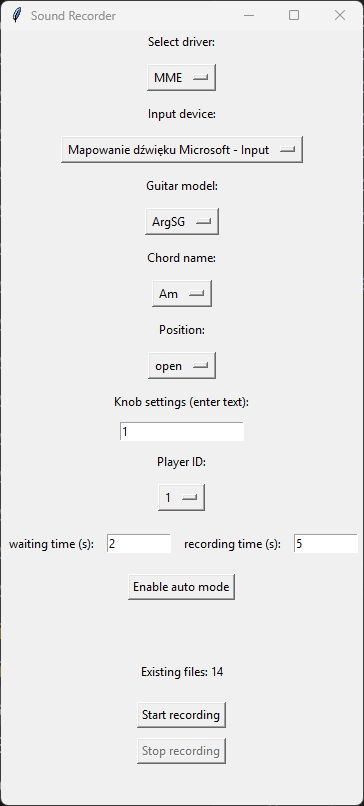

# Guitar Recorder

**Guitar Recorder** is a simple audio recording tool built using the [sounddevice](https://python-sounddevice.readthedocs.io/), [numpy](https://numpy.org/), [scipy](https://scipy.org/), and [tkinter](https://docs.python.org/3/library/tkinter.html) libraries. The program allows you to select an audio driver, input device, guitar model, chord name, position, knob settings, and player ID. It also supports an auto mode that automatically waits for a specified time before recording for a given duration.

## Features

- **Driver Selection** – Switch between different host APIs (e.g., MME, DirectSound, ASIO, etc., depending on your system).
- **Input Device Selection** – Choose from available audio devices (e.g., microphone, audio interface).
- **Configurable Recording Parameters** – Includes sampling rate (default 48 kHz), mono channel, and buffer size.
- **Recording Description** – The guitar model, chord name, position, knob settings, and player ID are automatically used to name the output `.wav` file.
- **Auto Mode** – The program can automatically wait for a specified number of seconds and then record for a set duration.
- **Automatic File Numbering** – If a file with a given name already exists, the program appends a sequential number to the new file name.
- **Graphical User Interface (GUI)** – Built with tkinter for a user-friendly experience.

## Requirements

- Python 3.8+ (Latest version recommended)
- Python libraries:
  - [sounddevice](https://pypi.org/project/sounddevice/)
  - [numpy](https://pypi.org/project/numpy/)
  - [scipy](https://pypi.org/project/scipy/)
  - [tkinter](https://docs.python.org/3/library/tkinter.html) (included in standard Python distributions)

## Installation

1. Clone the repository or download the source code:
   ```bash
   git clone https://github.com/cyptrix12/Guitar_Recorder_for_project.git
   cd Guitar_Recorder_for_project
   ```
2. Create and activate a virtual environment:
   ```bash
   python -m venv venv
   source venv/bin/activate  # Linux/macOS
   venv\Scripts\activate    # Windows
   ```
3. Install dependencies:
   ```bash
   pip install -r requirements.txt
   ```

## Running the Application

To run the application:
```bash
python main.py
```
*(or `python3 main.py`, depending on your system configuration).*

After a short moment, the application window with the GUI should appear:

<p align="center">
  
</p>

*Example of the application view (screenshot).*

## Usage

1. **Select driver** – Choose the available audio driver (e.g., MME, DirectSound, etc.).
2. **Input device** – Select the audio input device you want to record from.
3. **Guitar model / Chord name / Position / Knob settings / Player ID** – These details will be used to automatically name the output `.wav` file.
4. **Waiting time (s)** and **Recording time (s)** – Parameters used in auto mode (time to wait before recording and recording duration, respectively).
5. **Enable auto mode** – Activates auto mode. The program will wait for the specified time and then automatically record for the given duration.
6. **Start recording** – Manually start recording (manual mode).
7. **Stop recording** – Ends the recording.
8. **Existing files** – Displays the number of files that already exist in the `recordings` folder matching the current naming configuration.

Once the recording is completed, a `.wav` file will be saved in the `recordings` folder. If a file with the same name already exists, the new file's name will be automatically modified by appending a sequential number.

## File Structure

```
sound-recorder/
├── recordings/
│   └── ... (recorded .wav files)
├── main.py
└── README.md
```

- **recordings/** – Directory where all recordings are saved.
- **main.py** – Main file containing the application code.
- **README.md** – This file.


## File Naming Convention

Recorded files are named using a structured format to help identify their settings and content. The filename is composed of several parts separated by underscores (`_`) in the following order:

```
<GuitarModel>_<ChordName>_<Position>_<KnobSettings>_ID<PlayerID>_<RecordingNumber>.wav
```

For example, the file name:
```
ArgSG_Am_open_122_ID1_6.wav
```
represents:
- **ArgSG**: The guitar model selected.
- **Am**: The chord name.
- **open**: The playing position.
- **122**: The knob settings (switch in first position, vol max, tone max).
- **ID1**: The player ID (prefixed with "ID").
- **6**: The sequential recording number (indicating it is the 6th recording with these settings).

This naming convention ensures that each file is uniquely identified and easily traceable to its recording configuration.


**Happy Recording!**
